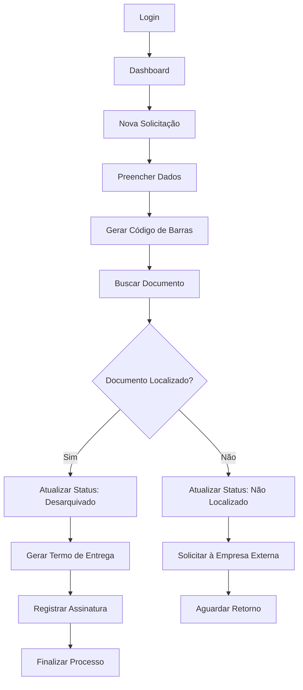
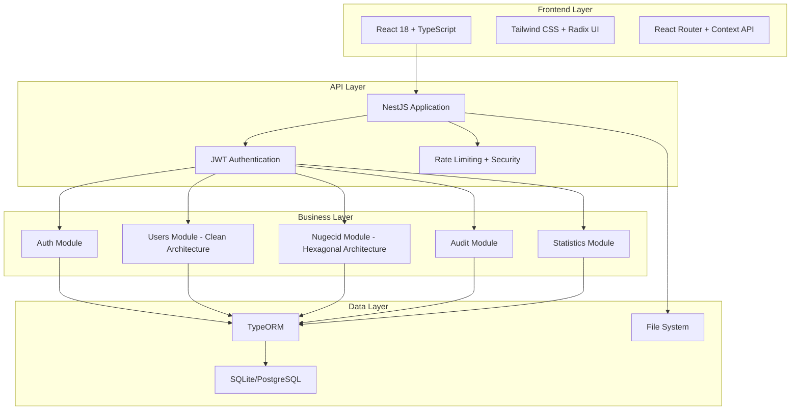
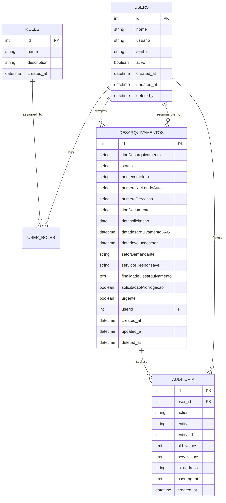

# Documento de Requisitos do Produto (PRD): Sistema de Gestão de Conteúdo - ITEP (SGC-ITEP)

**Versão:** 2.0  
**Data:** Janeiro 2025  
**Status:** Em Produção  
**Autor:** Kevin Patrick Borges  

---

## 1. Visão Geral do Produto

O SGC-ITEP v2.0 é um sistema web moderno de gestão documental desenvolvido especificamente para o Instituto Técnico-Científico de Perícia do Rio Grande do Norte (ITEP/RN). O sistema digitaliza e automatiza o processo de desarquivamento de documentos periciais, substituindo o controle manual por planilhas por uma solução robusta, auditável e escalável.

**Problema a resolver:** O setor NUGECID (Núcleo de Gestão de Conteúdo e Informação Documental) atualmente controla solicitações de desarquivamento através de planilhas manuais, processo suscetível a erros, sem rastreabilidade adequada e com baixa eficiência operacional.

**Valor do produto:** Modernização completa do fluxo de trabalho documental com controle de acesso, auditoria completa, geração automatizada de termos e preparação para integração futura com sistemas externos como SEIRN.

## 2. Papéis de Usuário

| Papel | Método de Registro | Permissões Principais |
|-------|-------------------|----------------------|
| Administrador | Criação direta no sistema | Acesso total: CRUD completo, gestão de usuários, relatórios globais |
| Coordenador | Cadastro por administrador | Gestão de desarquivamentos, visualização de dados de equipe |
| Operador | Cadastro por coordenador/admin | Operações básicas: criar e gerenciar próprios registros |
| Visualizador | Cadastro por níveis superiores | Apenas consulta de dados autorizados |

## 3. Funcionalidades Principais

### 3.1 Módulos do Sistema

O sistema SGC-ITEP v2.0 consiste nos seguintes módulos principais:

1. **Módulo de Autenticação**: Login seguro, controle de sessão, gestão de tokens JWT
2. **Módulo NUGECID**: Gestão completa de desarquivamentos (core do sistema)
3. **Módulo de Usuários**: Gestão de usuários e permissões baseadas em roles
4. **Módulo de Auditoria**: Rastreamento completo de ações do sistema
5. **Módulo de Estatísticas**: Dashboard e relatórios analíticos
6. **Módulo de Registros**: Gestão de registros gerais do sistema

### 3.2 Feature Module
O sistema SGC-ITEP consiste nas seguintes páginas principais:

1. **Dashboard**: visão geral das solicitações, estatísticas e alertas de atenção
2. **Login**: autenticação de usuários do sistema
3. **Nugecid - Lista de Desarquivamentos**: listagem e busca de solicitações
4. **Nugecid - Criar Desarquivamento**: formulário para nova solicitação
5. **Nugecid - Editar Desarquivamento**: edição de solicitação existente
6. **Nugecid - Detalhes**: visualização completa da solicitação
7. **Configurações**: gerenciamento de usuários e permissões

### 3.3 Page Details

| Page Name | Module Name | Feature description |
|-----------|-------------|---------------------|
| Dashboard | Estatísticas Gerais | Exibir total de solicitações e contador de solicitações que necessitam atenção (após 5 dias com status: retirado pelo setor, solicitado, não coletado) |
| Dashboard | Alertas de Atenção | Destacar solicitações pendentes há mais de 5 dias que precisam de acompanhamento |
| Login | Autenticação | Validar credenciais de usuário e estabelecer sessão segura |
| Nugecid - Lista | Listagem de Desarquivamentos | Exibir todas as solicitações com filtros por status, data, setor demandante e busca por texto |
| Nugecid - Lista | Ações em Lote | Permitir seleção múltipla e ações em massa nas solicitações |
| Nugecid - Criar | Formulário de Solicitação | Capturar dados: tipo, nome completo, número processo, tipo documento, setor demandante, servidor responsável, finalidade, urgência |
| Nugecid - Editar | Edição de Dados | Modificar informações da solicitação e atualizar status conforme fluxo |
| Nugecid - Detalhes | Visualização Completa | Mostrar todos os dados da solicitação, histórico de alterações e ações disponíveis |
| Nugecid - Detalhes | Geração de Termo | Gerar PDF do termo de desarquivamento com dados da solicitação |
| Configurações | Gerenciamento de Usuários | Criar, editar e desativar usuários do sistema com controle de permissões |

## 4. Fluxo Principal de Trabalho

### 4.1 Fluxo do Usuário
1. **Login** → Autenticação no sistema
2. **Dashboard** → Visualização do total de solicitações e alertas de atenção
3. **Nova Solicitação** → Preenchimento do formulário de desarquivamento
4. **Acompanhamento** → Verificação e atualização do status da solicitação
5. **Gestão** → Edição de solicitações e geração de termos PDF

### 4.2 Sistema de Alertas
- Solicitações com status "retirado pelo setor", "solicitado" ou "não coletado" há mais de 5 dias aparecem como "necessitam atenção"
- Dashboard destaca essas solicitações para acompanhamento prioritário

### 4.3 Processo de Desarquivamento

**Fluxo do Usuário Operador:**
1. Login no sistema → Dashboard
2. Criar nova solicitação de desarquivamento
3. Preencher dados da solicitação (solicitante, documento, finalidade)
4. Sistema gera código de barras único
5. Buscar documento no arquivo físico/digital
6. Atualizar status conforme localização
7. Gerar termo de desarquivamento
8. Registrar entrega e assinatura

**Fluxo do Coordenador/Admin:**
- Visualizar todas as solicitações
- Gerenciar equipe e distribuir tarefas
- Gerar relatórios e estatísticas
- Auditar ações do sistema



## 5. Design da Interface

### 5.1 Estilo de Design

- **Cores Primárias:** Azul institucional (#1e40af), Verde sucesso (#16a34a), Vermelho alerta (#dc2626)
- **Cores Secundárias:** Cinza neutro (#6b7280), Branco (#ffffff), Preto (#000000)
- **Tipografia:** Inter (sistema), tamanhos 12px-24px
- **Estilo de Botões:** Arredondados (border-radius: 6px), com estados hover e focus
- **Layout:** Design responsivo com sidebar colapsável, cards para conteúdo
- **Ícones:** Lucide React para consistência visual

### 5.2 Componentes da Interface

| Página | Módulo | Elementos da UI |
|--------|--------|----------------|
| **Dashboard** | Estatísticas | Cards com métricas, gráficos interativos, tabela de atividades recentes |
| **Lista Desarquivamentos** | Nugecid | Tabela responsiva, filtros dropdown, paginação, botões de ação |
| **Formulário Desarquivamento** | Nugecid | Campos validados, seletores de data, upload de arquivos, preview |
| **Detalhes** | Nugecid | Layout em cards, badges de status, botões contextuais, timeline |
| **Gestão Usuários** | Usuários | Tabela com ações inline, modais de confirmação, formulários de edição |

### 5.3 Responsividade

O sistema é **desktop-first** com adaptação completa para tablets e dispositivos móveis. Implementa breakpoints responsivos e otimização para touch em dispositivos móveis.

## 6. Arquitetura Técnica

### 6.1 Diagrama de Arquitetura



### 6.2 Stack Tecnológico

- **Frontend:** React 18 + TypeScript + Vite + Tailwind CSS
- **Backend:** NestJS + TypeScript + TypeORM
- **Banco de Dados:** SQLite (desenvolvimento) / PostgreSQL (produção)
- **Autenticação:** JWT + Passport
- **Documentação:** Swagger/OpenAPI

### 6.3 Rotas da Aplicação

| Rota | Propósito |
|------|----------|
| `/login` | Página de autenticação |
| `/dashboard` | Dashboard principal com métricas |
| `/desarquivamentos` | Lista de desarquivamentos |
| `/desarquivamentos/novo` | Criar novo desarquivamento |
| `/desarquivamentos/:id` | Detalhes do desarquivamento |
| `/desarquivamentos/:id/editar` | Editar desarquivamento |
| `/usuarios` | Gestão de usuários (admin/coordenador) |
| `/configuracoes` | Configurações do sistema |
| `/lixeira` | Registros excluídos (soft delete) |
| `/nugecid/*` | Rotas específicas do módulo NUGECID |

### 6.4 APIs Principais

#### Autenticação
```
POST /auth/login          # Login do usuário
POST /auth/logout         # Logout
GET  /auth/profile        # Perfil do usuário
POST /auth/refresh        # Renovar token
```

#### NUGECID (Desarquivamentos)
```
GET    /nugecid                    # Listar desarquivamentos
POST   /nugecid                    # Criar desarquivamento
GET    /nugecid/:id                # Buscar por ID
PUT    /nugecid/:id                # Atualizar
DELETE /nugecid/:id                # Excluir (soft delete)
POST   /nugecid/import             # Importar via Excel
GET    /nugecid/:id/pdf            # Gerar PDF
GET    /nugecid/dashboard          # Estatísticas
GET    /nugecid/termo-entrega/:id  # Termo de entrega
```

#### Usuários
```
GET    /users             # Listar usuários
POST   /users             # Criar usuário
GET    /users/:id         # Buscar por ID
PUT    /users/:id         # Atualizar
DELETE /users/:id         # Excluir
POST   /users/:id/restore # Restaurar
GET    /users/statistics  # Estatísticas
```

## 7. Modelo de Dados

### 7.1 Entidades Principais



### 7.2 Entidade Desarquivamento

```typescript
interface Desarquivamento {
  id: number;
  tipoDesarquivamento: TipoDesarquivamento;
  status: StatusDesarquivamento;
  nomecompleto: string;
  numeroNicLaudoAuto?: string;
  numeroProcesso: string;
  tipoDocumento: string;
  datasolicitacao: Date;
  datadesarquivamentoSAG?: Date;
  datadevolucaosetor?: Date;
  setorDemandante: string;
  servidorResponsavel: string;
  finalidadeDesarquivamento: string;
  solicitacaoProrrogacao: boolean;
  urgente?: boolean;
  createdAt: Date;
  updatedAt: Date;
  deletedAt?: Date;
  userId: number;
}
```

### 7.2 Estrutura de Dados (DDL)

```sql
-- Tabela de Usuários
CREATE TABLE usuarios (
    id INTEGER PRIMARY KEY AUTOINCREMENT,
    nome VARCHAR(255) NOT NULL,
    usuario VARCHAR(255) UNIQUE NOT NULL,
    senha VARCHAR(255) NOT NULL,
    ativo BOOLEAN DEFAULT true,
    created_at DATETIME DEFAULT CURRENT_TIMESTAMP,
    updated_at DATETIME DEFAULT CURRENT_TIMESTAMP,
    deleted_at DATETIME NULL
);

-- Tabela de Roles
CREATE TABLE roles (
    id INTEGER PRIMARY KEY AUTOINCREMENT,
    name VARCHAR(50) UNIQUE NOT NULL,
    description TEXT,
    created_at DATETIME DEFAULT CURRENT_TIMESTAMP
);

-- Tabela de Desarquivamentos
CREATE TABLE desarquivamentos (
    id INTEGER PRIMARY KEY AUTOINCREMENT,
    codigo_barras VARCHAR(255) UNIQUE NOT NULL,
    tipo_solicitacao VARCHAR(50) NOT NULL,
    status VARCHAR(50) NOT NULL,
    nome_solicitante VARCHAR(255) NOT NULL,
    nome_vitima VARCHAR(255),
    numero_registro VARCHAR(100) NOT NULL,
    tipo_documento VARCHAR(100),
    data_fato DATE,
    prazo_atendimento DATETIME,
    data_atendimento DATETIME,
    resultado_atendimento TEXT,
    finalidade TEXT,
    observacoes TEXT,
    urgente BOOLEAN DEFAULT false,
    localizacao_fisica VARCHAR(255),
    criado_por_id INTEGER,
    responsavel_id INTEGER,
    created_at DATETIME DEFAULT CURRENT_TIMESTAMP,
    updated_at DATETIME DEFAULT CURRENT_TIMESTAMP,
    deleted_at DATETIME NULL,
    FOREIGN KEY (criado_por_id) REFERENCES usuarios(id),
    FOREIGN KEY (responsavel_id) REFERENCES usuarios(id)
);

-- Índices para Performance
CREATE INDEX idx_desarquivamentos_codigo_barras ON desarquivamentos(codigo_barras);
CREATE INDEX idx_desarquivamentos_status ON desarquivamentos(status);
CREATE INDEX idx_desarquivamentos_criado_por ON desarquivamentos(criado_por_id);
CREATE INDEX idx_desarquivamentos_created_at ON desarquivamentos(created_at DESC);

-- Dados Iniciais
INSERT INTO roles (name, description) VALUES 
('admin', 'Administrador do sistema'),
('coordenador', 'Coordenador de equipe'),
('operador', 'Operador básico'),
('visualizador', 'Apenas visualização');
```

## 8. Requisitos Funcionais Detalhados

### 8.1 RF-01: Autenticação e Autorização
- **Descrição:** Sistema seguro de login com controle de acesso baseado em roles
- **Critérios de Aceite:**
  - Login com usuário e senha
  - Tokens JWT com expiração configurável
  - Controle de acesso por roles (Admin, Coordenador, Operador, Visualizador)
  - Logout seguro com invalidação de token
  - Proteção contra ataques de força bruta

### 8.2 RF-02: Gestão de Desarquivamentos (CRUD)
- **Descrição:** Operações completas de criação, leitura, atualização e exclusão de registros
- **Critérios de Aceite:**
  - Formulário completo com todos os campos da planilha original
  - Geração automática de código de barras único
  - Controle de status do desarquivamento
  - Soft delete para preservar histórico
  - Validação de dados de entrada
  - Controle de permissões por usuário

### 8.3 RF-03: Importação e Exportação
- **Descrição:** Migração de dados existentes e geração de relatórios
- **Critérios de Aceite:**
  - Upload de planilhas Excel (.xlsx)
  - Validação de dados importados
  - Geração de PDF do termo de desarquivamento
  - Exportação de dados em Excel e PDF
  - Log de importações realizadas

### 8.4 RF-04: Sistema de Busca e Filtros
- **Descrição:** Localização eficiente de registros
- **Critérios de Aceite:**
  - Busca por múltiplos campos
  - Filtros por data, status, solicitante
  - Ordenação customizável
  - Paginação de resultados
  - Busca case-insensitive

### 8.5 RF-05: Dashboard e Relatórios
- **Descrição:** Visão analítica do sistema
- **Critérios de Aceite:**
  - Métricas em tempo real
  - Gráficos de performance
  - Relatórios por período
  - Estatísticas por usuário
  - Exportação de relatórios

## 9. Requisitos Não-Funcionais

### 9.1 Segurança
- Autenticação JWT com refresh tokens
- Hash de senhas com bcrypt (12+ rounds)
- Rate limiting para APIs
- Validação de entrada com class-validator
- Headers de segurança com Helmet
- Auditoria completa de ações

### 9.2 Performance
- Tempo de resposta < 2 segundos para operações básicas
- Paginação para listas com mais de 50 itens
- Índices de banco de dados otimizados
- Cache para consultas frequentes
- Compressão de respostas HTTP

### 9.3 Usabilidade
- Interface responsiva (desktop, tablet, mobile)
- Feedback visual para ações do usuário
- Mensagens de erro claras
- Navegação intuitiva
- Acessibilidade básica (WCAG 2.1)

### 9.4 Confiabilidade
- Backup automático de dados
- Soft delete para recuperação
- Log estruturado de erros
- Monitoramento de saúde da aplicação
- Tratamento de exceções

## 10. Roadmap e Próximas Funcionalidades

### 10.1 Versão 2.1 (Q2 2025)
- **Bot de Integração SEIRN:** Monitoramento automático de novas solicitações
- **Sistema de Notificações:** Alertas por email e no sistema
- **Relatórios Avançados:** Dashboard executivo com KPIs
- **API Webhooks:** Integração com sistemas externos

### 10.2 Versão 2.2 (Q3 2025)
- **Módulo de Custódia:** Controle de vestígios e evidências
- **Workflow Avançado:** Aprovações e fluxos customizáveis
- **Mobile App:** Aplicativo nativo para operações de campo
- **Integração OCR:** Digitalização automática de documentos

### 10.3 Versão 3.0 (Q4 2025)
- **Microserviços:** Arquitetura distribuída
- **Machine Learning:** Predição de demandas e otimização
- **Blockchain:** Trilha de auditoria imutável
- **API Gateway:** Centralização de APIs

## 11. Considerações de Implementação

### 11.1 Ambiente de Desenvolvimento
- Node.js 18+
- Docker para containerização
- Git para versionamento
- Jest para testes automatizados

### 11.2 Ambiente de Produção
- PostgreSQL como banco principal
- Redis para cache
- Nginx como proxy reverso
- SSL/TLS obrigatório
- Monitoramento com logs estruturados

### 11.3 Migração de Dados
- Script de migração das planilhas existentes
- Validação de integridade dos dados
- Backup completo antes da migração
- Rollback plan em caso de problemas

---

**Documento aprovado por:** Kevin Patrick Borges  
**Data de aprovação:** Janeiro 2025  
**Próxima revisão:** Abril 2025

