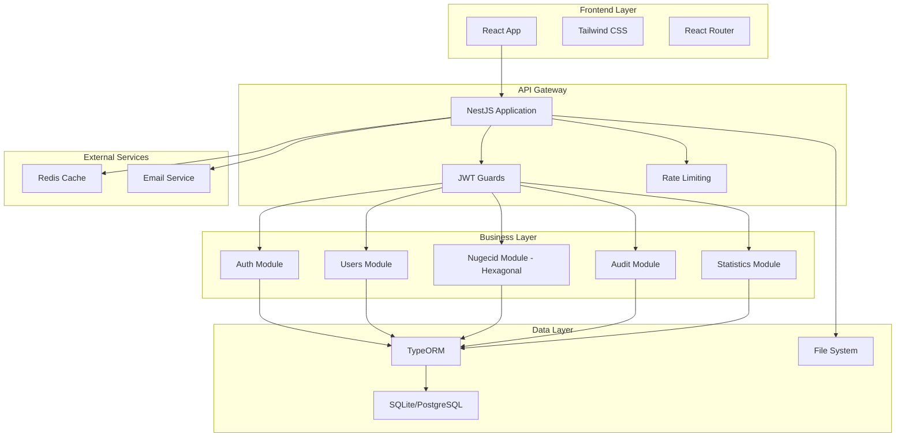
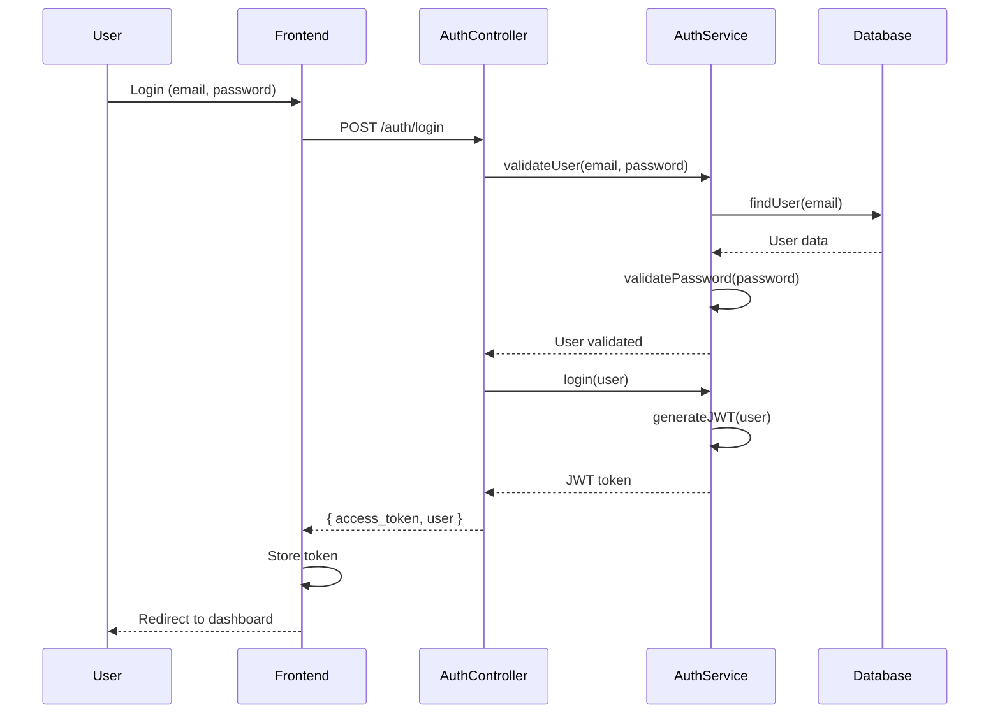
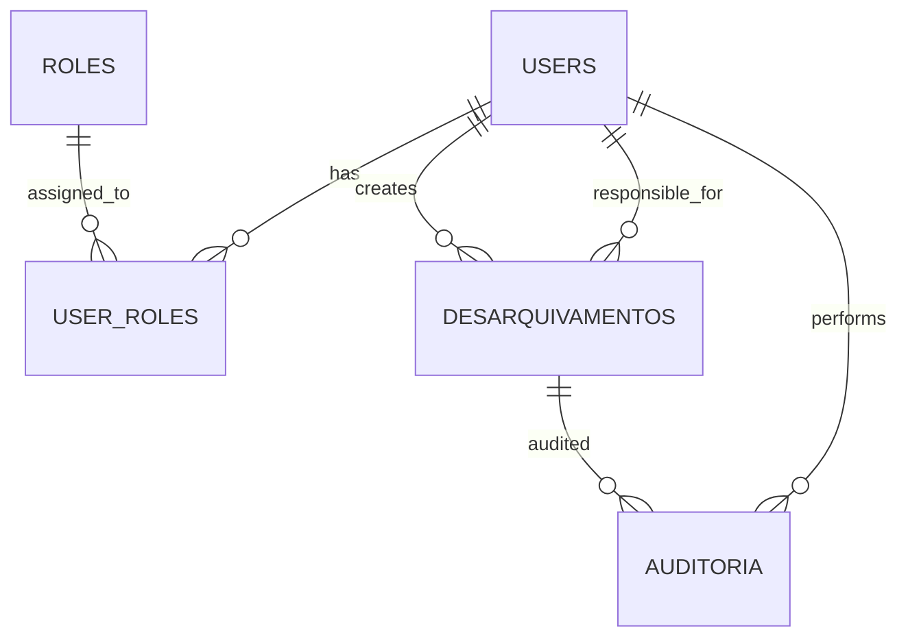

# SGC-ITEP v2.0 - Documentação Técnica Completa

**Autor:** Kevin Patrick Borges\
**Versão:** 2.0.0\
**Data:** Janeiro 2025

## 1. Visão Geral do Sistema

O SGC-ITEP v2.0 (Sistema de Gestão de Conteúdo - ITEP) é um sistema moderno de gestão documental desenvolvido para o Instituto Técnico-Científico de Perícia do Rio Grande do Norte (ITEP/RN). O sistema foi projetado com arquitetura moderna, implementando princípios de Clean Architecture e Domain-Driven Design (DDD).

### 1.1 Propósito

* **Gestão de Desarquivamentos (NUGECID)**: Controle completo do processo de desarquivamento de documentos periciais

* **Controle de Acesso Baseado em Funções (RBAC)**: Sistema robusto de autenticação e autorização

* **Auditoria Completa**: Rastreamento de todas as ações realizadas no sistema

* **Interface Web Responsiva**: Frontend moderno desenvolvido em React

* **API RESTful Documentada**: Backend escalável com documentação Swagger

### 1.2 Características Principais

* Arquitetura Hexagonal no módulo Nugecid

* Sistema de autenticação JWT

* Controle de acesso baseado em roles

* Auditoria completa de ações

* Upload e processamento de arquivos Excel

* Geração de PDFs e códigos de barras

* Interface responsiva com Tailwind CSS

* Testes automatizados (unitários e E2E)

## 2. Arquitetura Geral

### 2.1 Stack Tecnológico

#### Backend

* **Framework**: NestJS 10.x

* **Linguagem**: TypeScript

* **Banco de Dados**: SQLite (desenvolvimento) / PostgreSQL (produção)

* **ORM**: TypeORM

* **Autenticação**: JWT + Passport

* **Documentação**: Swagger/OpenAPI

* **Testes**: Jest + Playwright

#### Frontend

* **Framework**: React 18.x

* **Linguagem**: TypeScript

* **Build Tool**: Vite

* **Estilização**: Tailwind CSS

* **Componentes**: Radix UI

* **Roteamento**: React Router

* **Estado**: Context API

* **Notificações**: Sonner

#### Infraestrutura

* **Cache**: Redis (opcional)

* **Rate Limiting**: Throttler

* **File Upload**: Multer

* **Compressão**: Compression

* **Segurança**: Helmet

### 2.2 Diagrama de Arquitetura



## 3. Estrutura de Módulos

### 3.1 Módulo de Autenticação (Auth)

**Localização**: `src/modules/auth/`

**Responsabilidades**:

* Autenticação de usuários (login/logout)

* Geração e validação de tokens JWT

* Estratégias de autenticação (Local, JWT)

* Guards de proteção de rotas

**Componentes Principais**:

* `AuthController`: Endpoints de autenticação

* `AuthService`: Lógica de negócio de autenticação

* `LocalStrategy`: Estratégia de autenticação local

* `JwtStrategy`: Estratégia de validação JWT

* `JwtAuthGuard`: Guard global de autenticação

* `RolesGuard`: Guard de autorização por roles

### 3.2 Módulo de Usuários (Users)

**Localização**: `src/modules/users/`

**Responsabilidades**:

* Gestão de usuários do sistema

* Controle de roles e permissões

* Operações CRUD de usuários

* Estatísticas de usuários

**Arquitetura**: Implementa parcialmente Clean Architecture com:

* **Application Layer**: Use Cases

* **Domain Layer**: Entities e Repository Interfaces

* **Infrastructure Layer**: Repository Implementations

**Use Cases Implementados**:

* `CreateUserUseCase`

* `UpdateUserUseCase`

* `DeleteUserUseCase`

* `GetUserByIdUseCase`

* `GetUsersUseCase`

* `RestoreUserUseCase`

* `GetUserStatisticsUseCase`

* `GetRolesUseCase`

### 3.3 Módulo Nugecid (Arquitetura Hexagonal)

**Localização**: `src/modules/nugecid/`

**Responsabilidades**:

* Gestão completa de desarquivamentos

* Importação de dados via Excel

* Geração de relatórios e PDFs

* Dashboard com estatísticas

**Arquitetura Hexagonal Completa**:

#### Domain Layer (`domain/`)

* **Entities**: `DesarquivamentoDomain`

* **Value Objects**:

  * `DesarquivamentoId`

  * `CodigoBarras`

  * `NumeroRegistro`

  * `StatusDesarquivamento`

  * `TipoSolicitacao`

* **Repository Interface**: `IDesarquivamentoRepository`

#### Application Layer (`application/`)

* **Use Cases**:

  * `CreateDesarquivamentoUseCase`

  * `FindAllDesarquivamentosUseCase`

  * `FindDesarquivamentoByIdUseCase`

  * `UpdateDesarquivamentoUseCase`

  * `DeleteDesarquivamentoUseCase`

  * `GenerateTermoEntregaUseCase`

  * `GetDashboardStatsUseCase`

  * `ImportDesarquivamentoUseCase`

#### Infrastructure Layer (`infrastructure/`)

* **Entities**: `DesarquivamentoTypeOrmEntity`

* **Repositories**: `DesarquivamentoTypeOrmRepository`

* **Mappers**: `DesarquivamentoMapper`

### 3.4 Módulo de Auditoria (Audit)

**Localização**: `src/modules/audit/`

**Responsabilidades**:

* Registro de todas as ações do sistema

* Rastreamento de alterações

* Logs de segurança

### 3.5 Módulo de Estatísticas (Estatisticas)

**Localização**: `src/modules/estatisticas/`

**Responsabilidades**:

* Geração de relatórios estatísticos

* Dashboards analíticos

* Métricas de performance

### 3.6 Módulo de Registros (Registros)

**Localização**: `src/modules/registros/`

**Responsabilidades**:

* Gestão de registros gerais

* Operações CRUD básicas

### 3.7 Módulo de Seeding (Seeding)

**Localização**: `src/modules/seeding/`

**Responsabilidades**:

* Inicialização do banco de dados

* Criação de dados padrão

* Usuário administrador inicial

## 4. Fluxos de Autenticação e Autorização

### 4.1 Fluxo de Autenticação



### 4.2 Sistema de Roles

**Roles Disponíveis**:

* `ADMIN`: Acesso total ao sistema

* `COORDENADOR`: Gestão de desarquivamentos e usuários

* `OPERADOR`: Operações básicas de consulta e atualização

* `VISUALIZADOR`: Apenas visualização de dados

**Hierarquia de Permissões**:

```
ADMIN > COORDENADOR > OPERADOR > VISUALIZADOR
```

### 4.3 Guards Implementados

1. **JwtAuthGuard**: Validação global de tokens JWT
2. **RolesGuard**: Controle de acesso baseado em roles
3. **LocalAuthGuard**: Autenticação local para login

## 5. APIs e Endpoints

### 5.1 Autenticação

```
POST /auth/login          # Login do usuário
POST /auth/logout         # Logout do usuário
GET  /auth/profile        # Perfil do usuário logado
POST /auth/refresh        # Renovar token
```

### 5.2 Usuários

```
GET    /users             # Listar usuários
POST   /users             # Criar usuário
GET    /users/:id         # Buscar usuário por ID
PUT    /users/:id         # Atualizar usuário
DELETE /users/:id         # Excluir usuário
POST   /users/:id/restore # Restaurar usuário
GET    /users/statistics  # Estatísticas de usuários
GET    /users/roles       # Listar roles
```

### 5.3 Nugecid (Desarquivamentos)

```
GET    /nugecid                    # Listar desarquivamentos
POST   /nugecid                    # Criar desarquivamento
GET    /nugecid/:id                # Buscar por ID
PUT    /nugecid/:id                # Atualizar desarquivamento
DELETE /nugecid/:id                # Excluir desarquivamento
POST   /nugecid/import             # Importar via Excel
GET    /nugecid/:id/pdf            # Gerar PDF
GET    /nugecid/dashboard          # Estatísticas dashboard
GET    /nugecid/termo-entrega/:id  # Gerar termo de entrega
```

### 5.4 Auditoria

```
GET /audit                # Listar logs de auditoria
GET /audit/:id            # Buscar log específico
GET /audit/user/:userId   # Logs de um usuário
```

### 5.5 Estatísticas

```
GET /estatisticas/dashboard    # Dashboard geral
GET /estatisticas/relatorios   # Relatórios estatísticos
```

## 6. Estrutura do Banco de Dados

### 6.1 Entidades Principais

#### Users

```sql
CREATE TABLE users (
    id INTEGER PRIMARY KEY AUTOINCREMENT,
    email VARCHAR(255) UNIQUE NOT NULL,
    password VARCHAR(255) NOT NULL,
    name VARCHAR(255) NOT NULL,
    active BOOLEAN DEFAULT true,
    created_at DATETIME DEFAULT CURRENT_TIMESTAMP,
    updated_at DATETIME DEFAULT CURRENT_TIMESTAMP,
    deleted_at DATETIME NULL
);
```

#### Roles

```sql
CREATE TABLE roles (
    id INTEGER PRIMARY KEY AUTOINCREMENT,
    name VARCHAR(50) UNIQUE NOT NULL,
    description TEXT,
    created_at DATETIME DEFAULT CURRENT_TIMESTAMP
);
```

#### User\_Roles (Many-to-Many)

```sql
CREATE TABLE user_roles (
    user_id INTEGER,
    role_id INTEGER,
    PRIMARY KEY (user_id, role_id),
    FOREIGN KEY (user_id) REFERENCES users(id),
    FOREIGN KEY (role_id) REFERENCES roles(id)
);
```

#### Desarquivamentos

```sql
CREATE TABLE desarquivamentos (
    id INTEGER PRIMARY KEY AUTOINCREMENT,
    codigo_barras VARCHAR(255) UNIQUE NOT NULL,
    tipo_solicitacao VARCHAR(50) NOT NULL,
    status VARCHAR(50) NOT NULL,
    nome_solicitante VARCHAR(255) NOT NULL,
    nome_vitima VARCHAR(255),
    numero_registro VARCHAR(100) NOT NULL,
    tipo_documento VARCHAR(100),
    data_fato DATE,
    prazo_atendimento DATETIME,
    data_atendimento DATETIME,
    resultado_atendimento TEXT,
    finalidade TEXT,
    observacoes TEXT,
    urgente BOOLEAN DEFAULT false,
    localizacao_fisica VARCHAR(255),
    criado_por_id INTEGER,
    responsavel_id INTEGER,
    created_at DATETIME DEFAULT CURRENT_TIMESTAMP,
    updated_at DATETIME DEFAULT CURRENT_TIMESTAMP,
    deleted_at DATETIME NULL,
    FOREIGN KEY (criado_por_id) REFERENCES users(id),
    FOREIGN KEY (responsavel_id) REFERENCES users(id)
);
```

#### Auditoria

```sql
CREATE TABLE auditoria (
    id INTEGER PRIMARY KEY AUTOINCREMENT,
    user_id INTEGER,
    action VARCHAR(100) NOT NULL,
    entity VARCHAR(100) NOT NULL,
    entity_id INTEGER,
    old_values TEXT,
    new_values TEXT,
    ip_address VARCHAR(45),
    user_agent TEXT,
    created_at DATETIME DEFAULT CURRENT_TIMESTAMP,
    FOREIGN KEY (user_id) REFERENCES users(id)
);
```

### 6.2 Relacionamentos



## 7. Frontend React

### 7.1 Estrutura de Componentes

```
frontend/src/
├── components/
│   ├── auth/
│   │   ├── ProtectedRoute.tsx
│   │   └── LoginForm.tsx
│   ├── layout/
│   │   ├── Layout.tsx
│   │   ├── Header.tsx
│   │   ├── Sidebar.tsx
│   │   └── Footer.tsx
│   ├── ui/
│   │   ├── Button.tsx
│   │   ├── Input.tsx
│   │   ├── Modal.tsx
│   │   └── Table.tsx
│   └── nugecid/
│       ├── DesarquivamentoForm.tsx
│       ├── DesarquivamentoList.tsx
│       └── DesarquivamentoCard.tsx
├── pages/
│   ├── LoginPage.tsx
│   ├── DashboardPage.tsx
│   ├── DesarquivamentosPage.tsx
│   ├── NovoDesarquivamentoPage.tsx
│   └── nugecid/
│       ├── NugecidListPage.tsx
│       ├── NugecidCreatePage.tsx
│       ├── NugecidEditPage.tsx
│       └── NugecidDetailPage.tsx
├── contexts/
│   └── AuthContext.tsx
├── hooks/
│   ├── useAuth.ts
│   ├── useApi.ts
│   └── useLocalStorage.ts
├── services/
│   ├── api.ts
│   ├── auth.service.ts
│   └── nugecid.service.ts
├── types/
│   ├── auth.types.ts
│   ├── user.types.ts
│   └── nugecid.types.ts
└── utils/
    ├── formatters.ts
    ├── validators.ts
    └── constants.ts
```

### 7.2 Roteamento

O sistema utiliza React Router com proteção de rotas baseada em autenticação e roles:

* **Rotas Públicas**: `/login`

* **Rotas Protegidas**: Todas as demais rotas requerem autenticação

* **Rotas com Role**: Algumas rotas requerem roles específicos (COORDENADOR, ADMIN)

### 7.3 Estado Global

Utiliza Context API para gerenciamento de estado:

* **AuthContext**: Estado de autenticação do usuário

* **ThemeContext**: Configurações de tema (futuro)

### 7.4 Estilização

* **Tailwind CSS**: Framework CSS utilitário

* **Radix UI**: Componentes acessíveis

* **Responsive Design**: Adaptável para desktop, tablet e mobile

## 8. Configurações e Variáveis de Ambiente

### 8.1 Backend (.env)

```env
# Application
APP_NAME=SGC-ITEP v2.0
APP_VERSION=2.0.0
APP_DESCRIPTION=Sistema de Gestão de Conteúdo - ITEP
PORT=3000
HOST=0.0.0.0
NODE_ENV=development

# Database
DB_TYPE=sqlite
DB_PATH=nugecid_itep.sqlite
# Para PostgreSQL:
# DB_TYPE=postgres
# DB_HOST=localhost
# DB_PORT=5432
# DB_USERNAME=postgres
# DB_PASSWORD=password
# DB_DATABASE=sgc_itep
# DB_SSL=false

# JWT
JWT_SECRET=sgc-itep-secret-key-change-in-production
JWT_EXPIRES_IN=24h
JWT_REFRESH_SECRET=sgc-itep-refresh-secret-key
JWT_REFRESH_EXPIRES_IN=7d

# Session
SESSION_SECRET=sgc-itep-session-secret-change-in-production
SESSION_MAX_AGE=86400000

# Security
BCRYPT_ROUNDS=12
MAX_LOGIN_ATTEMPTS=5
LOCKOUT_DURATION=900000

# Rate Limiting
THROTTLE_TTL=60
THROTTLE_LIMIT=10

# File Upload
UPLOAD_PATH=./uploads
MAX_FILE_SIZE=10485760

# Redis (opcional)
# REDIS_URL=redis://localhost:6379

# Email (futuro)
# SMTP_HOST=smtp.gmail.com
# SMTP_PORT=587
# SMTP_USER=your-email@gmail.com
# SMTP_PASS=your-password
```

### 8.2 Frontend (.env)

```env
VITE_API_URL=http://localhost:3000
VITE_APP_NAME=SGC-ITEP v2.0
VITE_APP_VERSION=2.0.0
```

## 9. Scripts Disponíveis

### 9.1 Backend

```json
{
  "scripts": {
    "build": "nest build && (cd frontend && npm install && npm run build)",
    "format": "prettier --write \"src/**/*.ts\" \"test/**/*.ts\"",
    "start": "nest start",
    "dev": "concurrently \"npm:start:backend\" \"npm:start:frontend\"",
    "start:backend": "nest start --watch",
    "start:frontend": "cd frontend && npm run dev",
    "start:debug": "nest start --debug --watch",
    "start:prod": "node dist/main",
    "lint": "eslint \"{src,apps,libs,test}/**/*.ts\" --fix",
    "test": "jest",
    "test:watch": "jest --watch",
    "test:cov": "jest --coverage",
    "test:debug": "node --inspect-brk -r tsconfig-paths/register -r ts-node/register node_modules/.bin/jest --runInBand",
    "test:e2e": "jest --config ./test/jest-e2e.config.js",
    "test:e2e:watch": "jest --config ./test/jest-e2e.config.js --watch",
    "test:playwright": "npx playwright test",
    "test:playwright:ui": "npx playwright test --ui",
    "seed": "ts-node -r tsconfig-paths/register src/modules/seeding/seed.ts"
  }
}
```

### 9.2 Frontend

```json
{
  "scripts": {
    "dev": "vite",
    "build": "vite build",
    "lint": "eslint . --ext ts,tsx --report-unused-disable-directives --max-warnings 0",
    "preview": "vite preview"
  }
}
```

## 10. Como Executar o Projeto

### 10.1 Pré-requisitos

* Node.js >= 18.0.0

* npm >= 8.0.0

* Git

### 10.2 Instalação

```bash
# Clone o repositório
git clone <>
cd SGC-ITEP-NESTJS

# Instale as dependências do backend
npm install

# Instale as dependências do frontend
cd frontend
npm install
cd ..

# Configure as variáveis de ambiente
cp .env.example .env
# Edite o arquivo .env conforme necessário

# Execute as migrações e seed inicial
npm run seed
```

### 10.3 Execução em Desenvolvimento

```bash
# Executar backend e frontend simultaneamente
npm run dev

# Ou executar separadamente:
# Backend (porta 3000)
npm run start:backend

# Frontend (porta 3001)
npm run start:frontend
```

### 10.4 Execução em Produção

```bash
# Build da aplicação
npm run build

# Executar em produção
npm run start:prod
```

### 10.5 Testes

```bash
# Testes unitários
npm test

# Testes com coverage
npm run test:cov

# Testes E2E
npm run test:e2e

# Testes Playwright
npm run test:playwright
```

## 11. Funcionalidades Implementadas

### 11.1 Autenticação e Autorização

* ✅ Login/Logout com JWT

* ✅ Controle de acesso baseado em roles

* ✅ Guards de proteção de rotas

* ✅ Refresh token

* ✅ Bloqueio por tentativas de login

### 11.2 Gestão de Usuários

* ✅ CRUD completo de usuários

* ✅ Gestão de roles

* ✅ Soft delete

* ✅ Estatísticas de usuários

### 11.3 Módulo Nugecid

* ✅ CRUD de desarquivamentos

* ✅ Importação via Excel

* ✅ Geração de PDFs

* ✅ Códigos de barras

* ✅ Dashboard com estatísticas

* ✅ Filtros avançados

* ✅ Paginação

### 11.4 Auditoria

* ✅ Log de todas as ações

* ✅ Rastreamento de alterações

* ✅ Informações de IP e User Agent

### 11.5 Frontend

* ✅ Interface responsiva

* ✅ Roteamento protegido

* ✅ Formulários validados

* ✅ Notificações toast

* ✅ Loading states

* ✅ Error handling

## 12. Próximas Implementações

### 12.1 Funcionalidades Planejadas

* 🔄 Sistema de notificações por email

* 🔄 Relatórios avançados

* 🔄 Integração com sistemas externos

* 🔄 API de webhooks

* 🔄 Sistema de backup automático

* 🔄 Logs estruturados

* 🔄 Monitoramento e métricas

### 12.2 Melhorias Técnicas

* 🔄 Implementação completa de Clean Architecture em todos os módulos

* 🔄 Testes de integração mais abrangentes

* 🔄 Documentação automática de APIs

* 🔄 CI/CD pipeline

* 🔄 Containerização com Docker

* 🔄 Kubernetes deployment

## 13. Considerações de Segurança

### 13.1 Implementadas

* ✅ Autenticação JWT segura

* ✅ Hash de senhas com bcrypt

* ✅ Rate limiting

* ✅ Helmet para headers de segurança

* ✅ Validação de entrada

* ✅ Sanitização de dados

* ✅ CORS configurado

### 13.2 Recomendações

* 🔒 Implementar HTTPS em produção

* 🔒 Configurar firewall adequado

* 🔒 Monitoramento de segurança

* 🔒 Backup regular dos dados

* 🔒 Auditoria de segurança periódica

## 14. Performance e Escalabilidade

### 14.1 Otimizações Implementadas

* ✅ Cache com Redis (opcional)

* ✅ Compressão de respostas

* ✅ Paginação de resultados

* ✅ Índices de banco de dados

* ✅ Lazy loading no frontend

### 14.2 Considerações para Escala

* 📈 Load balancer para múltiplas instâncias

* 📈 Separação de banco de dados (read/write)

* 📈 CDN para assets estáticos

* 📈 Microserviços para módulos específicos

* 📈 Queue system para processamento assíncrono

***

**Documentação gerada automaticamente em:** Janeiro 2025\
**Versão do Sistema:** 2.0.0\
**Última atualização:** Agosto 2025

Para mais informações técnicas, consulte o código-fonte ou entre em contato com a equipe de desenvolvimento.
