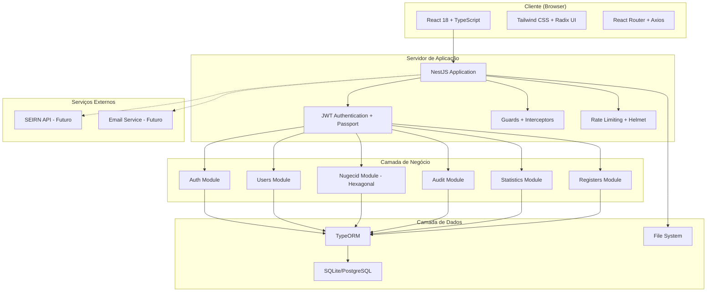
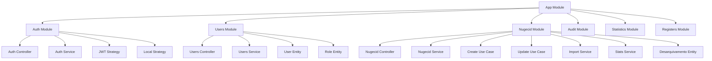
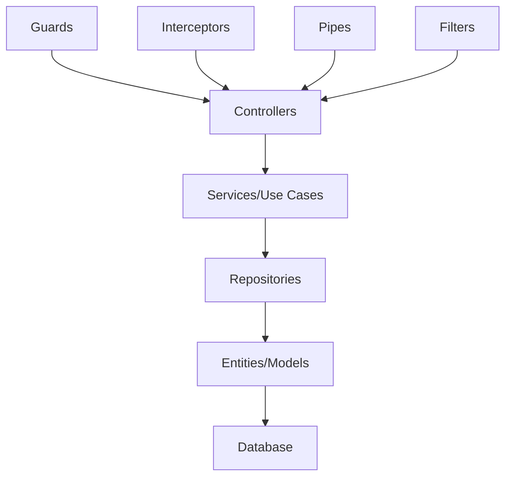
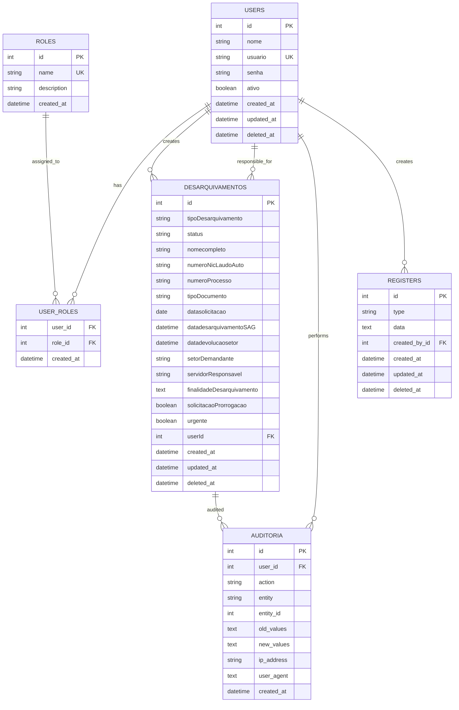

# Documentação Técnica: Sistema de Gestão de Conteúdo - ITEP (SGC-ITEP)

**Versão:** 1.0\
**Data:** Jun 2025\
**Status:** Em Produção\
**Autor:** Kevin Patrick Borges

***

## 1. Arquitetura do Sistema



## 2. Stack Tecnológico

* **Frontend:** React 18 + TypeScript + Vite + Tailwind CSS + Radix UI + ShadcnUI

* **Backend:** NestJS + TypeScript + TypeORM + Passport JWT

* **Banco de Dados:** PostgreSQL (Docker)

* **Autenticação:** Session-based with NestJS

* **Documentação:** Swagger/OpenAPI

* **Testes:** Jest + Supertest

* **Build:** Vite (frontend) + TSC (backend)

* **Deploy:** Vercel (Frontend) + Docker (Backend + Database)

## 3. Definições de Rotas

### 3.1 Rotas do Frontend

| Rota                                 | Componente                  | Propósito                                                          | Proteção                |
| ------------------------------------ | --------------------------- | ------------------------------------------------------------------ | ----------------------- |
| `/login`                             | LoginPage                   | Autenticação de usuários                                           | Público                 |
| `/`                                  | Dashboard                   | Dashboard principal com total de solicitações e alertas de atenção | Autenticado             |
| `/dashboard`                         | Dashboard                   | Dashboard principal                                                | Autenticado             |
| `/nugecid`                           | NugecidListPage             | Lista principal do módulo Nugecid                                  | Autenticado             |
| `/nugecid/desarquivamentos`          | ListaDesarquivamentosPage   | Lista de solicitações de desarquivamento                           | Autenticado             |
| `/nugecid/desarquivamentos/create`   | NovoDesarquivamentoPage     | Formulário para criar nova solicitação                             | Autenticado             |
| `/nugecid/desarquivamentos/:id`      | DetalhesDesarquivamentoPage | Detalhes de uma solicitação específica                             | Autenticado             |
| `/nugecid/desarquivamentos/:id/edit` | EditarDesarquivamentoPage   | Edição de solicitação existente                                    | Autenticado + Permissão |
| `/usuarios`                          | UsuariosPage                | Gestão de usuários                                                 | Admin/Coordenador       |
| `/usuarios/create`                   | CreateUserPage              | Criar novo usuário                                                 | Admin/Coordenador       |
| `/usuarios/:id/edit`                 | EditUserPage                | Editar usuário existente                                           | Admin/Coordenador       |
| `/configuracoes`                     | ConfiguracoesPage           | Configurações gerais do sistema                                    | Autenticado             |

### 3.2 Estrutura de Componentes React

```
src/
├── components/
│   ├── ui/                    # Componentes base (Radix UI)
│   │   ├── Button.tsx
│   │   ├── Input.tsx
│   │   ├── Modal.tsx
│   │   └── Table.tsx
│   ├── layout/
│   │   ├── Layout.tsx         # Layout principal
│   │   ├── Sidebar.tsx        # Navegação lateral
│   │   └── Header.tsx         # Cabeçalho
│   └── forms/
│       ├── DesarquivamentoForm.tsx
│       └── UserForm.tsx
├── pages/
│   ├── auth/
│   │   └── LoginPage.tsx
│   ├── dashboard/
│   │   └── Dashboard.tsx
│   ├── desarquivamentos/
│   │   ├── ListaDesarquivamentosPage.tsx
│   │   ├── NovoDesarquivamentoPage.tsx
│   │   ├── DetalhesDesarquivamentoPage.tsx
│   │   └── EditarDesarquivamentoPage.tsx
│   ├── nugecid/
│   │   ├── NugecidListPage.tsx
│   │   ├── NugecidCreatePage.tsx
│   │   ├── NugecidEditPage.tsx
│   │   └── NugecidDetailPage.tsx
│   └── usuarios/
│       └── UsuariosPage.tsx
├── contexts/
│   ├── AuthContext.tsx        # Contexto de autenticação
│   └── ThemeContext.tsx       # Contexto de tema
├── services/
│   ├── api.ts                 # Cliente Axios configurado
│   ├── auth.service.ts        # Serviços de autenticação
│   └── nugecid.service.ts     # Serviços NUGECID
└── types/
    ├── auth.types.ts
    ├── nugecid.types.ts
    └── common.types.ts
```

## 4. APIs e Endpoints

### 4.1 Core API

**Autenticação**

```
POST /api/auth/login
```

Request:

| Param Name | Param Type | isRequired | Description      |
| ---------- | ---------- | ---------- | ---------------- |
| email      | string     | true       | Email do usuário |
| password   | string     | true       | Senha do usuário |

Response:

| Param Name | Param Type | Description                  |
| ---------- | ---------- | ---------------------------- |
| success    | boolean    | Status da autenticação       |
| user       | User       | Dados do usuário autenticado |
| token      | string     | Token de sessão              |

**Nugecid - Desarquivamentos**

```
GET /api/nugecid/desarquivamentos
POST /api/nugecid/desarquivamentos
GET /api/nugecid/desarquivamentos/:id
PUT /api/nugecid/desarquivamentos/:id
DELETE /api/nugecid/desarquivamentos/:id
GET /api/nugecid/desarquivamentos/:id/pdf
```

**Usuários**

```
GET /api/users
POST /api/users
GET /api/users/:id
PUT /api/users/:id
DELETE /api/users/:id
```

**Dashboard e Estatísticas**

```
GET /api/stats/dashboard
GET /api/stats/alertas
```

### 4.2 Módulo NUGECID (Desarquivamentos)

#### Listar Desarquivamentos

```
GET /nugecid?page=1&limit=10&search=termo&status=ativo
```

**Query Parameters:**

| Parâmetro    | Tipo   | Descrição                     |
| ------------ | ------ | ----------------------------- |
| page         | number | Página atual (padrão: 1)      |
| limit        | number | Itens por página (padrão: 10) |
| search       | string | Termo de busca                |
| status       | string | Filtro por status             |
| solicitante  | string | Filtro por solicitante        |
| data\_inicio | string | Data inicial (YYYY-MM-DD)     |
| data\_fim    | string | Data final (YYYY-MM-DD)       |

**Response:**

```json
{
  "data": [
    {
      "id": 1,
      "codigo_barras": "DES20250101001",
      "tipo_solicitacao": "Laudo",
      "status": "Em Andamento",
      "nome_solicitante": "João Silva",
      "numero_registro": "2025/001",
      "created_at": "2025-01-01T10:00:00Z"
    }
  ],
  "meta": {
    "page": 1,
    "limit": 10,
    "total": 150,
    "totalPages": 15
  }
}
```

#### Criar Desarquivamento

```
POST /nugecid
```

**Request:**

```json
{
  "tipo_solicitacao": "Laudo",
  "nome_solicitante": "João Silva",
  "nome_vitima": "Maria Santos",
  "numero_registro": "2025/001",
  "tipo_documento": "Laudo Pericial",
  "data_fato": "2024-12-15",
  "finalidade": "Processo judicial",
  "urgente": false,
  "observacoes": "Solicitação urgente"
}
```

#### Gerar PDF do Termo

```
GET /nugecid/:id/pdf
```

**Response:** Arquivo PDF com o termo de desarquivamento preenchido

#### Importar Planilha Excel

```
POST /nugecid/import
Content-Type: multipart/form-data
```

**Request:**

* `file`: Arquivo Excel (.xlsx)

### 4.3 Módulo de Usuários

#### Listar Usuários

```
GET /users?page=1&limit=10&ativo=true
```

#### Criar Usuário

```
POST /users
```

**Request:**

```json
{
  "nome": "Novo Usuário",
  "usuario": "novo.usuario",
  "senha": "senha123",
  "roles": ["operador"]
}
```

### 4.4 Módulo de Estatísticas

#### Dashboard Principal

```
GET /nugecid/dashboard
```

**Response:**

```json
{
  "total_registros": 1250,
  "registros_mes": 85,
  "pendentes": 23,
  "finalizados": 1180,
  "grafico_mensal": [
    {"mes": "Jan", "total": 95},
    {"mes": "Fev", "total": 87}
  ],
  "top_solicitantes": [
    {"nome": "João Silva", "total": 15}
  ]
}
```

## 5. Arquitetura do Servidor

### 5.1 Estrutura de Módulos NestJS



### 5.2 Camadas da Aplicação



### 5.3 Estrutura de Pastas Backend

```
src/
├── auth/
│   ├── auth.controller.ts
│   ├── auth.service.ts
│   ├── auth.module.ts
│   ├── guards/
│   │   ├── jwt-auth.guard.ts
│   │   └── roles.guard.ts
│   ├── strategies/
│   │   ├── jwt.strategy.ts
│   │   └── local.strategy.ts
│   └── dto/
│       └── login.dto.ts
├── users/
│   ├── users.controller.ts
│   ├── users.service.ts
│   ├── users.module.ts
│   ├── entities/
│   │   ├── user.entity.ts
│   │   └── role.entity.ts
│   └── dto/
│       ├── create-user.dto.ts
│       └── update-user.dto.ts
├── nugecid/
│   ├── nugecid.controller.ts
│   ├── nugecid.service.ts
│   ├── nugecid.module.ts
│   ├── entities/
│   │   └── desarquivamento.entity.ts
│   ├── dto/
│   │   ├── create-desarquivamento.dto.ts
│   │   └── update-desarquivamento.dto.ts
│   ├── use-cases/
│   │   ├── create-desarquivamento.use-case.ts
│   │   ├── update-desarquivamento.use-case.ts
│   │   └── delete-desarquivamento.use-case.ts
│   └── services/
│       ├── nugecid-import.service.ts
│       └── nugecid-stats.service.ts
├── audit/
│   ├── audit.service.ts
│   ├── audit.module.ts
│   ├── entities/
│   │   └── auditoria.entity.ts
│   └── interceptors/
│       └── audit.interceptor.ts
├── common/
│   ├── decorators/
│   ├── filters/
│   ├── guards/
│   ├── interceptors/
│   └── pipes/
└── config/
    ├── database.config.ts
    ├── jwt.config.ts
    └── app.config.ts
```

## 6. Modelo de Dados

### 6.1 Diagrama Entidade-Relacionamento



### 6.2 Definições de Entidades TypeORM

#### Entidade User

```typescript
@Entity('usuarios')
export class User {
  @PrimaryGeneratedColumn()
  id: number;

  @Column({ length: 255 })
  nome: string;

  @Column({ length: 255, unique: true })
  usuario: string;

  @Column({ length: 255 })
  senha: string;

  @Column({ default: true })
  ativo: boolean;

  @ManyToMany(() => Role, role => role.users)
  @JoinTable({ name: 'user_roles' })
  roles: Role[];

  @OneToMany(() => Desarquivamento, desarquivamento => desarquivamento.user)
  desarquivamentosCriados: Desarquivamento[];

  @CreateDateColumn()
  created_at: Date;

  @UpdateDateColumn()
  updated_at: Date;

  @DeleteDateColumn()
  deleted_at: Date;
}
```

#### Entidade Desarquivamento

```typescript
@Entity('desarquivamentos')
export class Desarquivamento {
  @PrimaryGeneratedColumn()
  id: number;

  @Column({ length: 100 })
  tipoDesarquivamento: string;

  @Column({ length: 50, default: 'solicitado' })
  status: string;

  @Column({ length: 200 })
  nomecompleto: string;

  @Column({ length: 100, nullable: true })
  numeroNicLaudoAuto: string;

  @Column({ length: 100 })
  numeroProcesso: string;

  @Column({ length: 100 })
  tipoDocumento: string;

  @Column({ type: 'date' })
  datasolicitacao: Date;

  @Column({ type: 'datetime', nullable: true })
  datadesarquivamentoSAG: Date;

  @Column({ type: 'datetime', nullable: true })
  datadevolucaosetor: Date;

  @Column({ length: 100 })
  setorDemandante: string;

  @Column({ length: 200 })
  servidorResponsavel: string;

  @Column({ type: 'text' })
  finalidadeDesarquivamento: string;

  @Column({ default: false })
  solicitacaoProrrogacao: boolean;

  @Column({ default: false })
  urgente: boolean;

  @ManyToOne(() => User, user => user.desarquivamentosCriados)
  @JoinColumn({ name: 'userId' })
  user: User;

  @CreateDateColumn()
  created_at: Date;

  @UpdateDateColumn()
  updated_at: Date;

  @DeleteDateColumn()
  deleted_at: Date;
}
```

### 6.2 Data Definition Language

**Tabela de Usuários (users)**

```sql
CREATE TABLE users (
    id SERIAL PRIMARY KEY,
    nome VARCHAR(100) NOT NULL,
    usuario VARCHAR(50) UNIQUE NOT NULL,
    senha_hash VARCHAR(255) NOT NULL,
    email VARCHAR(100) UNIQUE NOT NULL,
    ativo BOOLEAN DEFAULT true,
    created_at TIMESTAMP WITH TIME ZONE DEFAULT NOW(),
    updated_at TIMESTAMP WITH TIME ZONE DEFAULT NOW(),
    deleted_at TIMESTAMP WITH TIME ZONE
);

CREATE INDEX idx_users_usuario ON users(usuario);
CREATE INDEX idx_users_email ON users(email);
CREATE INDEX idx_users_ativo ON users(ativo);
```

**Tabela de Roles (roles)**

```sql
CREATE TABLE roles (
    id SERIAL PRIMARY KEY,
    nome VARCHAR(50) UNIQUE NOT NULL,
    descricao TEXT,
    created_at TIMESTAMP WITH TIME ZONE DEFAULT NOW(),
    updated_at TIMESTAMP WITH TIME ZONE DEFAULT NOW()
);

INSERT INTO roles (nome, descricao) VALUES 
('admin', 'Administrador do sistema'),
('coordenador', 'Coordenador de setor'),
('operador', 'Operador padrão');
```

**Tabela de Desarquivamentos (desarquivamentos)**

```sql
CREATE TABLE desarquivamentos (
    id SERIAL PRIMARY KEY,
    "tipoDesarquivamento" VARCHAR(100) NOT NULL,
    status VARCHAR(50) DEFAULT 'solicitado',
    nomecompleto VARCHAR(200) NOT NULL,
    "numeroNicLaudoAuto" VARCHAR(100),
    "numeroProcesso" VARCHAR(100) NOT NULL,
    "tipoDocumento" VARCHAR(100) NOT NULL,
    datasolicitacao DATE NOT NULL,
    "datadesarquivamentoSAG" TIMESTAMP WITH TIME ZONE,
    datadevolucaosetor TIMESTAMP WITH TIME ZONE,
    "setorDemandante" VARCHAR(100) NOT NULL,
    "servidorResponsavel" VARCHAR(200) NOT NULL,
    "finalidadeDesarquivamento" TEXT NOT NULL,
    "solicitacaoProrrogacao" BOOLEAN DEFAULT false,
    urgente BOOLEAN DEFAULT false,
    "userId" INTEGER REFERENCES users(id),
    created_at TIMESTAMP WITH TIME ZONE DEFAULT NOW(),
    updated_at TIMESTAMP WITH TIME ZONE DEFAULT NOW(),
    deleted_at TIMESTAMP WITH TIME ZONE
);

CREATE INDEX idx_desarquivamentos_status ON desarquivamentos(status);
CREATE INDEX idx_desarquivamentos_tipo ON desarquivamentos("tipoDesarquivamento");
CREATE INDEX idx_desarquivamentos_data ON desarquivamentos(created_at DESC);
CREATE INDEX idx_desarquivamentos_urgente ON desarquivamentos(urgente);
CREATE INDEX idx_desarquivamentos_setor ON desarquivamentos("setorDemandante");
```

### 6.3 Scripts de Migração

#### Criação das Tabelas Principais

```sql
-- Migration: CreateUsersTable
CREATE TABLE usuarios (
    id INTEGER PRIMARY KEY AUTOINCREMENT,
    nome VARCHAR(255) NOT NULL,
    usuario VARCHAR(255) UNIQUE NOT NULL,
    senha VARCHAR(255) NOT NULL,
    ativo BOOLEAN DEFAULT true,
    created_at DATETIME DEFAULT CURRENT_TIMESTAMP,
    updated_at DATETIME DEFAULT CURRENT_TIMESTAMP,
    deleted_at DATETIME NULL
);

-- Migration: CreateRolesTable
CREATE TABLE roles (
    id INTEGER PRIMARY KEY AUTOINCREMENT,
    name VARCHAR(50) UNIQUE NOT NULL,
    description TEXT,
    created_at DATETIME DEFAULT CURRENT_TIMESTAMP
);

-- Migration: CreateUserRolesTable
CREATE TABLE user_roles (
    user_id INTEGER,
    role_id INTEGER,
    created_at DATETIME DEFAULT CURRENT_TIMESTAMP,
    PRIMARY KEY (user_id, role_id),
    FOREIGN KEY (user_id) REFERENCES usuarios(id) ON DELETE CASCADE,
    FOREIGN KEY (role_id) REFERENCES roles(id) ON DELETE CASCADE
);

-- Migration: CreateDesarquivamentosTable
CREATE TABLE desarquivamentos (
    id INTEGER PRIMARY KEY AUTOINCREMENT,
    codigo_barras VARCHAR(255) UNIQUE NOT NULL,
    tipo_solicitacao VARCHAR(50) NOT NULL,
    status VARCHAR(50) NOT NULL,
    nome_solicitante VARCHAR(255) NOT NULL,
    nome_vitima VARCHAR(255),
    numero_registro VARCHAR(100) NOT NULL,
    tipo_documento VARCHAR(100),
    data_fato DATE,
    prazo_atendimento DATETIME,
    data_atendimento DATETIME,
    resultado_atendimento TEXT,
    finalidade TEXT,
    observacoes TEXT,
    urgente BOOLEAN DEFAULT false,
    localizacao_fisica VARCHAR(255),
    criado_por_id INTEGER,
    responsavel_id INTEGER,
    created_at DATETIME DEFAULT CURRENT_TIMESTAMP,
    updated_at DATETIME DEFAULT CURRENT_TIMESTAMP,
    deleted_at DATETIME NULL,
    FOREIGN KEY (criado_por_id) REFERENCES usuarios(id),
    FOREIGN KEY (responsavel_id) REFERENCES usuarios(id)
);

-- Índices para Performance
CREATE INDEX idx_desarquivamentos_codigo_barras ON desarquivamentos(codigo_barras);
CREATE INDEX idx_desarquivamentos_status ON desarquivamentos(status);
CREATE INDEX idx_desarquivamentos_solicitante ON desarquivamentos(nome_solicitante);
CREATE INDEX idx_desarquivamentos_created_at ON desarquivamentos(created_at DESC);
CREATE INDEX idx_desarquivamentos_criado_por ON desarquivamentos(criado_por_id);

-- Dados Iniciais
INSERT INTO roles (name, description) VALUES 
('admin', 'Administrador do sistema'),
('coordenador', 'Coordenador de equipe'),
('operador', 'Operador básico'),
('visualizador', 'Apenas visualização');

-- Usuário Administrador Padrão
INSERT INTO usuarios (nome, usuario, senha, ativo) VALUES 
('Administrador', 'admin', '$2b$12$hash_da_senha_123456', true);

INSERT INTO user_roles (user_id, role_id) VALUES (1, 1);
```

## 7. Configurações e Deployment

### 7.1 Variáveis de Ambiente

```env
# Database
DATABASE_TYPE=sqlite
DATABASE_PATH=./database.sqlite
# Para produção:
# DATABASE_TYPE=postgres
# DATABASE_HOST=localhost
# DATABASE_PORT=5432
# DATABASE_USERNAME=sgc_user
# DATABASE_PASSWORD=senha_segura
# DATABASE_NAME=sgc_itep

# JWT
JWT_SECRET=sua_chave_secreta_muito_segura_aqui
JWT_EXPIRES_IN=24h

# Application
PORT=3000
NODE_ENV=development

# Security
RATE_LIMIT_TTL=60
RATE_LIMIT_LIMIT=100

# File Upload
MAX_FILE_SIZE=10485760  # 10MB
UPLOAD_DEST=./uploads

# Logging
LOG_LEVEL=info
LOG_FILE=./logs/app.log
```

### 7.2 Scripts de Build e Deploy

#### package.json (Backend)

```json
{
  "scripts": {
    "build": "nest build",
    "format": "prettier --write \"src/**/*.ts\" \"test/**/*.ts\"",
    "start": "nest start",
    "start:dev": "nest start --watch",
    "start:debug": "nest start --debug --watch",
    "start:prod": "node dist/main",
    "lint": "eslint \"{src,apps,libs,test}/**/*.ts\" --fix",
    "test": "jest",
    "test:watch": "jest --watch",
    "test:cov": "jest --coverage",
    "test:debug": "node --inspect-brk -r tsconfig-paths/register -r ts-node/register node_modules/.bin/jest --runInBand",
    "test:e2e": "jest --config ./test/jest-e2e.json",
    "migration:generate": "typeorm-ts-node-commonjs migration:generate",
    "migration:run": "typeorm-ts-node-commonjs migration:run",
    "migration:revert": "typeorm-ts-node-commonjs migration:revert"
  }
}
```

#### package.json (Frontend)

```json
{
  "scripts": {
    "dev": "vite",
    "build": "tsc && vite build",
    "lint": "eslint . --ext ts,tsx --report-unused-disable-directives --max-warnings 0",
    "preview": "vite preview",
    "type-check": "tsc --noEmit"
  }
}
```

### 7.3 Configuração Docker

#### Dockerfile (Backend)

```dockerfile
FROM node:18-alpine

WORKDIR /app

COPY package*.json ./
RUN npm ci --only=production

COPY . .
RUN npm run build

EXPOSE 3000

CMD ["npm", "run", "start:prod"]
```

#### docker-compose.yml

```yaml
version: '3.8'

services:
  backend:
    build: ./backend
    ports:
      - "3000:3000"
    environment:
      - NODE_ENV=production
      - DATABASE_TYPE=postgres
      - DATABASE_HOST=db
    depends_on:
      - db
    volumes:
      - ./uploads:/app/uploads
      - ./logs:/app/logs

  frontend:
    build: ./frontend
    ports:
      - "80:80"
    depends_on:
      - backend

  db:
    image: postgres:15-alpine
    environment:
      POSTGRES_DB: sgc_itep
      POSTGRES_USER: sgc_user
      POSTGRES_PASSWORD: senha_segura
    volumes:
      - postgres_data:/var/lib/postgresql/data
    ports:
      - "5432:5432"

volumes:
  postgres_data:
```

## 8. Segurança e Boas Práticas

### 8.1 Implementações de Segurança

* **Autenticação JWT:** Tokens com expiração configurável

* **Hash de Senhas:** bcrypt com 12 rounds de salt

* **Rate Limiting:** Proteção contra ataques de força bruta

* **Helmet:** Headers de segurança HTTP

* **CORS:** Configuração restritiva para origens permitidas

* **Validação:** class-validator em todos os DTOs

* **Sanitização:** Prevenção contra XSS e SQL Injection

* **Auditoria:** Log completo de ações críticas

### 8.2 Guards e Interceptors

```typescript
// JWT Auth Guard
@Injectable()
export class JwtAuthGuard extends AuthGuard('jwt') {
  canActivate(context: ExecutionContext) {
    return super.canActivate(context);
  }
}

// Roles Guard
@Injectable()
export class RolesGuard implements CanActivate {
  constructor(private reflector: Reflector) {}

  canActivate(context: ExecutionContext): boolean {
    const requiredRoles = this.reflector.getAllAndOverride<string[]>(
      'roles',
      [context.getHandler(), context.getClass()]
    );
    
    if (!requiredRoles) {
      return true;
    }
    
    const { user } = context.switchToHttp().getRequest();
    return requiredRoles.some(role => user.roles?.includes(role));
  }
}

// Audit Interceptor
@Injectable()
export class AuditInterceptor implements NestInterceptor {
  constructor(private auditService: AuditService) {}

  intercept(context: ExecutionContext, next: CallHandler): Observable<any> {
    const request = context.switchToHttp().getRequest();
    const { method, url, user, body } = request;
    
    return next.handle().pipe(
      tap(() => {
        this.auditService.log({
          userId: user?.id,
          action: method,
          entity: this.extractEntity(url),
          oldValues: null,
          newValues: body,
          ipAddress: request.ip,
          userAgent: request.get('User-Agent')
        });
      })
    );
  }
}
```

## 9. Testes e Qualidade

### 9.1 Estrutura de Testes

```
test/
├── unit/
│   ├── auth/
│   │   ├── auth.service.spec.ts
│   │   └── auth.controller.spec.ts
│   ├── nugecid/
│   │   ├── nugecid.service.spec.ts
│   │   └── nugecid.controller.spec.ts
│   └── users/
│       ├── users.service.spec.ts
│       └── users.controller.spec.ts
├── integration/
│   ├── auth.e2e-spec.ts
│   ├── nugecid.e2e-spec.ts
│   └── users.e2e-spec.ts
└── fixtures/
    ├── users.fixture.ts
    └── desarquivamentos.fixture.ts
```

### 9.2 Configuração Jest

```javascript
// jest.config.js
module.exports = {
  moduleFileExtensions: ['js', 'json', 'ts'],
  rootDir: 'src',
  testRegex: '.*\\.spec\\.ts$',
  transform: {
    '^.+\\.(t|j)s$': 'ts-jest',
  },
  collectCoverageFrom: [
    '**/*.(t|j)s',
    '!**/*.spec.ts',
    '!**/node_modules/**',
  ],
  coverageDirectory: '../coverage',
  testEnvironment: 'node',
  coverageThreshold: {
    global: {
      branches: 80,
      functions: 80,
      lines: 80,
      statements: 80
    }
  }
};
```

## 10. Monitoramento e Logs

### 10.1 Configuração de Logs

```typescript
// logger.config.ts
import { WinstonModule } from 'nest-winston';
import * as winston from 'winston';

export const loggerConfig = WinstonModule.createLogger({
  transports: [
    new winston.transports.Console({
      format: winston.format.combine(
        winston.format.timestamp(),
        winston.format.colorize(),
        winston.format.simple()
      )
    }),
    new winston.transports.File({
      filename: 'logs/error.log',
      level: 'error',
      format: winston.format.combine(
        winston.format.timestamp(),
        winston.format.json()
      )
    }),
    new winston.transports.File({
      filename: 'logs/combined.log',
      format: winston.format.combine(
        winston.format.timestamp(),
        winston.format.json()
      )
    })
  ]
});
```

### 10.2 Health Check

```typescript
// health.controller.ts
@Controller('health')
export class HealthController {
  constructor(
    private health: HealthCheckService,
    private db: TypeOrmHealthIndicator
  ) {}

  @Get()
  @HealthCheck()
  check() {
    return this.health.check([
      () => this.db.pingCheck('database'),
    ]);
  }
}
```

***

**Documento técnico aprovado por:** Kevin Patrick Borges\
**Data de aprovação:** Setembro 2025\
**Próxima revisão:** Outubro 2025\
**Versão da API:** v1.0
