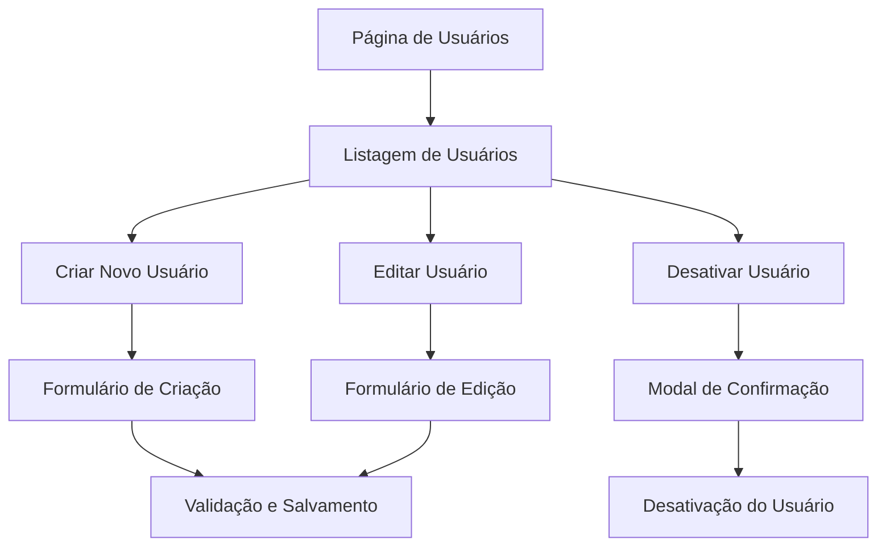
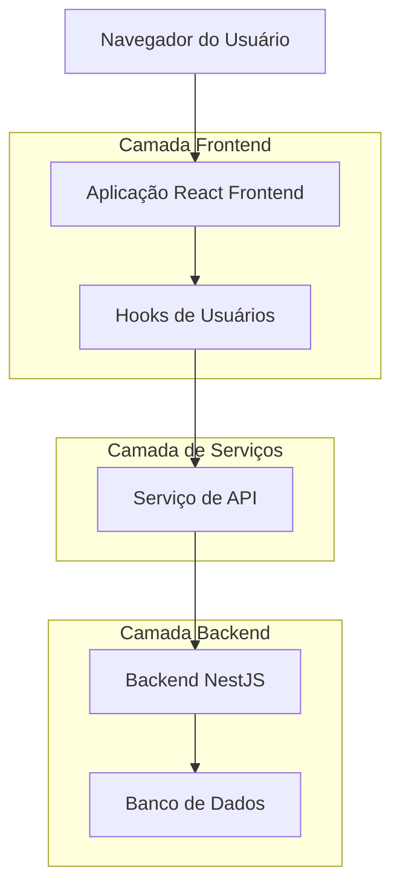
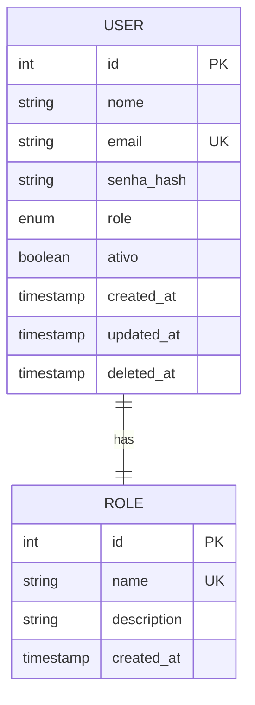

# Especificação das Páginas de Usuários - SGC-ITEP

## 1. Visão Geral do Projeto

Implementação completa do módulo de gerenciamento de usuários no Sistema de Gerenciamento de Controle de Desarquivamentos - ITEP, incluindo páginas de listagem, criação, edição e exclusão de usuários com controle rigoroso de permissões.

## 2. Funcionalidades Principais

### 2.1 Papéis de Usuário

| Papel       | Método de Registro          | Permissões Principais                        |
| ----------- | --------------------------- | -------------------------------------------- |
| ADMIN       | Criação manual pelo sistema | Acesso completo ao gerenciamento de usuários |
| COORDENADOR | Criação pelo ADMIN          | Acesso limitado - apenas visualização        |
| USUARIO     | Criação pelo ADMIN          | Sem acesso ao módulo de usuários             |

### 2.2 Módulos de Funcionalidade

O sistema de usuários consistirá nas seguintes páginas principais:

1. **Página de Listagem de Usuários**: tabela com filtros, paginação, busca e ações
2. **Página de Criação de Usuário**: formulário completo para cadastro
3. **Página de Edição de Usuário**: formulário para atualização de dados
4. **Modal de Confirmação**: para exclusão/desativação de usuários

### 2.3 Detalhes das Páginas

| Nome da Página       | Nome do Módulo         | Descrição da Funcionalidade                                                                                   |
| -------------------- | ---------------------- | ------------------------------------------------------------------------------------------------------------- |
| Listagem de Usuários | Tabela de Usuários     | Exibir todos os usuários com filtros por nome, email, papel e status. Incluir paginação e busca em tempo real |
| Listagem de Usuários | Filtros Avançados      | Filtrar por papel (ADMIN/COORDENADOR/USUARIO), status (ativo/inativo), data de criação                        |
| Listagem de Usuários | Ações da Tabela        | Botões para visualizar, editar e desativar usuários. Controle de permissões por ação                          |
| Criação de Usuário   | Formulário de Cadastro | Campos: nome, email, senha, confirmação de senha, papel. Validações em tempo real                             |
| Criação de Usuário   | Validação de Dados     | Validar email único, senha forte, campos obrigatórios                                                         |
| Edição de Usuário    | Formulário de Edição   | Permitir edição de nome, email, papel e status. Senha opcional                                                |
| Edição de Usuário    | Controle de Permissões | ADMIN pode editar todos os campos, outros papéis têm restrições                                               |

## 3. Fluxo Principal de Operações

### Fluxo do Administrador

1. Acessa a página de usuários através da barra lateral
2. Visualiza lista completa de usuários com filtros
3. Pode criar novos usuários clicando em "Novo Usuário"
4. Pode editar usuários existentes clicando no ícone de edição
5. Pode desativar usuários através do menu de ações
6. Recebe feedback visual para todas as operações

### Fluxo do Coordenador

1. Acessa a página de usuários (apenas visualização)
2. Pode visualizar detalhes dos usuários
3. Não tem acesso às funcionalidades de criação/edição



## 4. Design da Interface do Usuário

### 4.1 Estilo de Design

* **Cores primárias**: Azul (#3B82F6) para ações principais, Cinza (#6B7280) para elementos secundários

* **Estilo dos botões**: Arredondados com sombra sutil, estados hover e disabled

* **Fonte**: Inter, tamanhos 14px para texto normal, 16px para títulos

* **Layout**: Design baseado em cards com navegação superior fixa

* **Ícones**: Lucide React para consistência visual

### 4.2 Visão Geral do Design das Páginas

| Nome da Página       | Nome do Módulo | Elementos da UI                                                                        |
| -------------------- | -------------- | -------------------------------------------------------------------------------------- |
| Listagem de Usuários | Cabeçalho      | Título "Gerenciamento de Usuários", botão "Novo Usuário" (azul, ícone Plus)            |
| Listagem de Usuários | Filtros        | Barra de busca, filtros dropdown para papel e status, botão "Limpar Filtros"           |
| Listagem de Usuários | Tabela         | Colunas: Nome, Email, Papel, Status, Data de Criação, Ações. Ordenação clicável        |
| Listagem de Usuários | Paginação      | Controles de página com informações de total de registros                              |
| Criação de Usuário   | Formulário     | Card com campos organizados em seções, validação em tempo real, botões Cancelar/Salvar |
| Edição de Usuário    | Formulário     | Layout similar à criação, com dados pré-preenchidos e opções condicionais              |

### 4.3 Responsividade

O sistema será desktop-first com adaptação para tablets e dispositivos móveis. Em telas menores, a tabela se tornará scrollável horizontalmente e os filtros se reorganizarão em layout vertical.

## 5. Arquitetura Técnica

### 5.1 Estrutura de Arquitetura



### 5.2 Descrição das Tecnologias

* Frontend: React\@18 + TypeScript + TailwindCSS + Vite

* Backend: NestJS (já existente)

* Banco de Dados: PostgreSQL via TypeORM

* Gerenciamento de Estado: TanStack Query (React Query)

### 5.3 Definições de Rotas

| Rota                 | Propósito                                |
| -------------------- | ---------------------------------------- |
| /usuarios            | Página principal de listagem de usuários |
| /usuarios/novo       | Página de criação de novo usuário        |
| /usuarios/:id/editar | Página de edição de usuário específico   |

### 5.4 Definições de API

#### 5.4.1 APIs Principais

**Listar usuários**

```
GET /api/users
```

Request:

| Nome do Parâmetro | Tipo    | Obrigatório | Descrição                     |
| ----------------- | ------- | ----------- | ----------------------------- |
| page              | number  | false       | Número da página (padrão: 1)  |
| limit             | number  | false       | Itens por página (padrão: 25) |
| search            | string  | false       | Busca por nome ou email       |
| role              | string  | false       | Filtro por papel do usuário   |
| active            | boolean | false       | Filtro por status ativo       |

Response:

| Nome do Parâmetro | Tipo    | Descrição                |
| ----------------- | ------- | ------------------------ |
| success           | boolean | Status da resposta       |
| data              | User\[] | Array de usuários        |
| meta              | object  | Informações de paginação |

**Criar usuário**

```
POST /api/users
```

Request:

| Nome do Parâmetro | Tipo     | Obrigatório | Descrição                                    |
| ----------------- | -------- | ----------- | -------------------------------------------- |
| nome              | string   | true        | Nome completo do usuário                     |
| email             | string   | true        | Email único do usuário                       |
| senha             | string   | true        | Senha do usuário                             |
| role              | UserRole | true        | Papel do usuário (ADMIN/COORDENADOR/USUARIO) |

Response:

| Nome do Parâmetro | Tipo    | Descrição               |
| ----------------- | ------- | ----------------------- |
| success           | boolean | Status da operação      |
| data              | User    | Dados do usuário criado |
| message           | string  | Mensagem de sucesso     |

**Atualizar usuário**

```
PATCH /api/users/:id
```

Request:

| Nome do Parâmetro | Tipo     | Obrigatório | Descrição                |
| ----------------- | -------- | ----------- | ------------------------ |
| nome              | string   | false       | Nome completo do usuário |
| email             | string   | false       | Email do usuário         |
| senha             | string   | false       | Nova senha (opcional)    |
| role              | UserRole | false       | Papel do usuário         |
| ativo             | boolean  | false       | Status ativo do usuário  |

**Desativar usuário**

```
DELETE /api/users/:id
```

Response:

| Nome do Parâmetro | Tipo    | Descrição               |
| ----------------- | ------- | ----------------------- |
| success           | boolean | Status da operação      |
| message           | string  | Mensagem de confirmação |

### 5.5 Modelo de Dados

#### 5.5.1 Definição do Modelo de Dados



#### 5.5.2 Linguagem de Definição de Dados

**Tabela de Usuários (users)**

```sql
-- Estrutura já existente, apenas para referência
CREATE TABLE users (
    id SERIAL PRIMARY KEY,
    nome VARCHAR(255) NOT NULL,
    email VARCHAR(255) UNIQUE NOT NULL,
    senha_hash VARCHAR(255) NOT NULL,
    role VARCHAR(50) NOT NULL DEFAULT 'USUARIO',
    ativo BOOLEAN DEFAULT true,
    created_at TIMESTAMP WITH TIME ZONE DEFAULT NOW(),
    updated_at TIMESTAMP WITH TIME ZONE DEFAULT NOW(),
    deleted_at TIMESTAMP WITH TIME ZONE NULL
);

-- Índices para performance
CREATE INDEX idx_users_email ON users(email);
CREATE INDEX idx_users_role ON users(role);
CREATE INDEX idx_users_ativo ON users(ativo);
CREATE INDEX idx_users_created_at ON users(created_at DESC);

-- Dados iniciais (se necessário)
INSERT INTO users (nome, email, senha_hash, role) VALUES 
('Administrador', 'admin@itep.pe.gov.br', '$2b$10$...', 'ADMIN')
ON CONFLICT (email) DO NOTHING;
```

## 6. Implementação Detalhada

### 6.1 Hooks Necessários

**useUsers.ts**

* `useUsers(params)` - Listar usuários com filtros e paginação

* `useUser(id)` - Obter usuário específico

* `useCreateUser()` - Criar novo usuário

* `useUpdateUser()` - Atualizar usuário existente

* `useDeleteUser()` - Desativar usuário

### 6.2 Componentes a Criar

**Páginas:**

* `UsuariosPage.tsx` - Página principal de listagem

* `NovoUsuarioPage.tsx` - Página de criação

* `EditarUsuarioPage.tsx` - Página de edição

**Componentes:**

* `UsuariosTable.tsx` - Tabela de usuários

* `UsuarioForm.tsx` - Formulário reutilizável

* `UsuarioFilters.tsx` - Filtros da listagem

* `DeleteUserModal.tsx` - Modal de confirmação

### 6.3 Validações e Regras de Negócio

1. **Email único**: Verificar se o email já existe no sistema
2. **Senha forte**: Mínimo 8 caracteres, incluindo maiúscula, minúscula e número
3. **Permissões**: Apenas ADMIN pode criar/editar/desativar usuários
4. **Auto-exclusão**: Usuário não pode desativar a própria conta
5. **Último admin**: Sistema deve manter pelo menos um usuário ADMIN ativo

### 6.4 Tratamento de Erros

* Validação em tempo real nos formulários

* Mensagens de erro específicas para cada campo

* Toast notifications para feedback de operações

* Estados de loading durante requisições

* Fallbacks para erros de rede

### 6.5 Testes e Qualidade

* Testes unitários para hooks e componentes

* Testes de integração para fluxos completos

* Validação de acessibilidade (ARIA labels)

* Testes de responsividade em diferentes dispositivos

* Validação de performance com grandes volumes de dados

