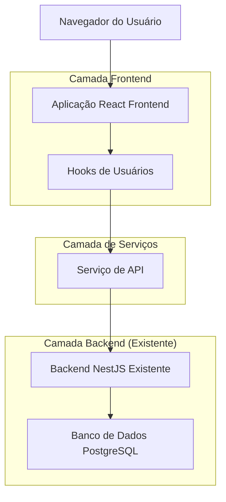
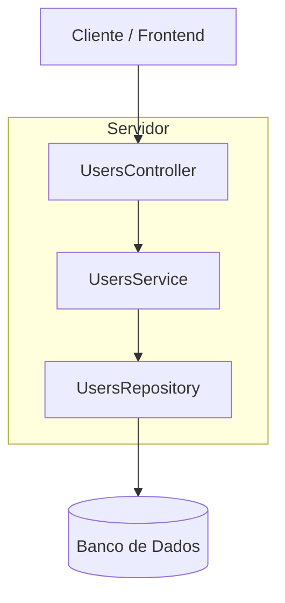
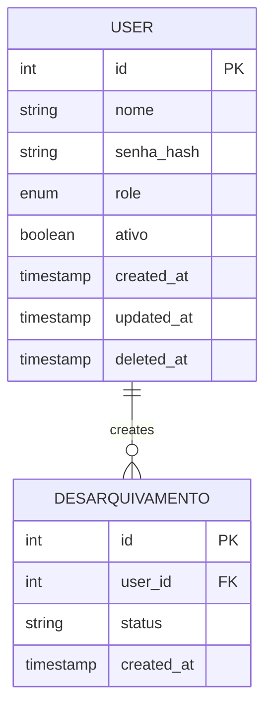

# Arquitetura Técnica - Módulo de Usuários SGC-ITEP

## 1. Arquitetura de Design



## 2. Descrição das Tecnologias

* Frontend: React\@18 + TypeScript + TailwindCSS + Vite

* Backend: NestJS (já implementado)

* Banco de Dados: PostgreSQL via TypeORM (já configurado)

* Gerenciamento de Estado: TanStack Query (React Query)

* Validação: Zod para validação de formulários

* UI Components: Lucide React para ícones

## 3. Definições de Rotas

| Rota                 | Propósito                                                                |
| -------------------- | ------------------------------------------------------------------------ |
| /usuarios            | Página principal de listagem de usuários com tabela, filtros e paginação |
| /usuarios/novo       | Página de criação de novo usuário com formulário completo                |
| /usuarios/:id/editar | Página de edição de usuário específico com dados pré-preenchidos         |

## 4. Definições de API

### 4.1 APIs Principais

**Listar usuários com filtros e paginação**

```
GET /api/users
```

Request:

| Nome do Parâmetro | Tipo     | Obrigatório | Descrição                                      |
| ----------------- | -------- | ----------- | ---------------------------------------------- |
| page              | number   | false       | Número da página para paginação (padrão: 1)    |
| limit             | number   | false       | Quantidade de itens por página (padrão: 25)    |
| role              | UserRole | false       | Filtro por papel (ADMIN, COORDENADOR, USUARIO) |
| active            | boolean  | false       | Filtro por status ativo/inativo                |

Response:

| Nome do Parâmetro | Tipo           | Descrição                                            |
| ----------------- | -------------- | ---------------------------------------------------- |
| success           | boolean        | Indica se a operação foi bem-sucedida                |
| data              | User\[]        | Array com os dados dos usuários                      |
| meta              | PaginationMeta | Informações de paginação (total, página atual, etc.) |

Exemplo de Response:

```json
{
  "success": true,
  "data": [
    {
      "id": 1,
      "nome": "João Silva",
      "role": "COORDENADOR",
      "ativo": true,
      "created_at": "2024-01-15T10:30:00Z"
    }
  ],
  "meta": {
    "total": 50,
    "page": 1,
    "limit": 25,
    "totalPages": 2
  }
}
```

**Criar novo usuário**

```
POST /api/users
```

Request:

| Nome do Parâmetro | Tipo     | Obrigatório | Descrição                                      |
| ----------------- | -------- | ----------- | ---------------------------------------------- |
| nome              | string   | true        | Nome completo do usuário                       |                     |
| senha             | string   | true        | Senha do usuário (será hasheada no backend)    |
| role              | UserRole | true        | Papel do usuário (ADMIN, COORDENADOR, USUARIO) |

Response:

| Nome do Parâmetro | Tipo    | Descrição                           |
| ----------------- | ------- | ----------------------------------- |
| success           | boolean | Status da operação                  |
| data              | User    | Dados do usuário criado (sem senha) |
| message           | string  | Mensagem de sucesso                 |

Exemplo de Request:

```json
{
  "nome": "Maria Santos",
  "senha": "MinhaSenh@123",
  "role": "COORDENADOR"
}
```

**Atualizar usuário existente**

```
PATCH /api/users/:id
```

Request:

| Nome do Parâmetro | Tipo     | Obrigatório | Descrição                            |
| ----------------- | -------- | ----------- | ------------------------------------ |
| nome              | string   | false       | Nome completo do usuário             |                  |
| senha             | string   | false       | Nova senha (opcional, será hasheada) |
| role              | UserRole | false       | Papel do usuário                     |
| ativo             | boolean  | false       | Status ativo do usuário              |

Response:

| Nome do Parâmetro | Tipo    | Descrição                    |
| ----------------- | ------- | ---------------------------- |
| success           | boolean | Status da operação           |
| data              | User    | Dados atualizados do usuário |
| message           | string  | Mensagem de confirmação      |

**Obter usuário específico**

```
GET /api/users/:id
```

Response:

| Nome do Parâmetro | Tipo    | Descrição                  |
| ----------------- | ------- | -------------------------- |
| success           | boolean | Status da operação         |
| data              | User    | Dados completos do usuário |

**Desativar usuário**

```
DELETE /api/users/:id
```

Response:

| Nome do Parâmetro | Tipo    | Descrição                              |
| ----------------- | ------- | -------------------------------------- |
| success           | boolean | Status da operação                     |
| message           | string  | Mensagem de confirmação da desativação |

## 5. Arquitetura do Servidor



## 6. Modelo de Dados

### 6.1 Definição do Modelo de Dados



### 6.2 Linguagem de Definição de Dados

**Estrutura da Tabela de Usuários (já existente)**

```sql
-- A tabela users já existe no sistema, esta é apenas a referência
CREATE TABLE users (
    id SERIAL PRIMARY KEY,
    nome VARCHAR(255) NOT NULL,
    senha_hash VARCHAR(255) NOT NULL,
    role VARCHAR(50) NOT NULL DEFAULT 'USUARIO' CHECK (role IN ('ADMIN', 'COORDENADOR', 'USUARIO')),
    ativo BOOLEAN DEFAULT true,
    created_at TIMESTAMP WITH TIME ZONE DEFAULT NOW(),
    updated_at TIMESTAMP WITH TIME ZONE DEFAULT NOW(),
    deleted_at TIMESTAMP WITH TIME ZONE NULL
);

-- Índices para otimização de consultas
CREATE INDEX idx_users_email ON users(email);
CREATE INDEX idx_users_role ON users(role);
CREATE INDEX idx_users_ativo ON users(ativo);
CREATE INDEX idx_users_created_at ON users(created_at DESC);
CREATE INDEX idx_users_nome ON users(nome);

-- Dados iniciais (se necessário)
INSERT INTO users (nome, email, senha_hash, role) VALUES 
('Administrador do Sistema', 'admin@itep.pe.gov.br', '$2b$10$exemplo_hash_senha', 'ADMIN')
ON CONFLICT (email) DO NOTHING;
```

## 7. Implementação Frontend

### 7.1 Estrutura de Arquivos

```
frontend/src/
├── pages/
│   └── usuarios/
│       ├── UsuariosPage.tsx
│       ├── NovoUsuarioPage.tsx
│       └── EditarUsuarioPage.tsx
├── components/
│   └── usuarios/
│       ├── UsuariosTable.tsx
│       ├── UsuarioForm.tsx
│       ├── UsuarioFilters.tsx
│       └── DeleteUserModal.tsx
├── hooks/
│   └── useUsers.ts
├── services/
│   └── api.ts (extensão dos métodos existentes)
└── types/
    └── index.ts (tipos já existentes)
```

### 7.2 Hooks Personalizados

**useUsers.ts**

```typescript
// Hooks para gerenciamento de usuários
export const useUsers = (params?: UsersQueryParams) => {
  // Implementação com TanStack Query
};

export const useUser = (id: number) => {
  // Hook para obter usuário específico
};

export const useCreateUser = () => {
  // Hook para criação de usuário
};

export const useUpdateUser = () => {
  // Hook para atualização de usuário
};

export const useDeleteUser = () => {
  // Hook para desativação de usuário
};
```

### 7.3 Serviços de API

**Extensão do api.ts existente**

```typescript
// Métodos a serem adicionados ao apiService existente
class ApiService {
  // ... métodos existentes
  
  async getUsers(params?: UsersQueryParams): Promise<UsersResponse> {
    // Implementação da listagem de usuários
  }
  
  async getUser(id: number): Promise<UserResponse> {
    // Implementação para obter usuário específico
  }
  
  async createUser(data: CreateUserDto): Promise<UserResponse> {
    // Implementação para criar usuário
  }
  
  async updateUser(id: number, data: UpdateUserDto): Promise<UserResponse> {
    // Implementação para atualizar usuário
  }
  
  async deleteUser(id: number): Promise<DeleteResponse> {
    // Implementação para desativar usuário
  }
}
```

### 7.4 Tipos TypeScript

**Extensão dos tipos existentes**

```typescript
// Tipos a serem adicionados ao index.ts existente
export interface UsersQueryParams {
  page?: number;
  limit?: number;
  search?: string;
  role?: UserRole;
  active?: boolean;
}

export interface CreateUserDto {
  nome: string;
  senha: string;
  role: UserRole;
}

export interface UpdateUserDto {
  nome?: string;
  senha?: string;
  role?: UserRole;
  ativo?: boolean;
}

export interface UsersResponse {
  success: boolean;
  data: User[];
  meta: PaginationMeta;
}

export interface UserResponse {
  success: boolean;
  data: User;
  message?: string;
}

export interface PaginationMeta {
  total: number;
  page: number;
  limit: number;
  totalPages: number;
}
```

## 8. Controle de Permissões

### 8.1 Regras de Acesso

* **ADMIN**: Acesso completo a todas as funcionalidades de usuários

* **COORDENADOR**: Apenas visualização da lista de usuários

* **USUARIO**: Sem acesso ao módulo de usuários

### 8.2 Implementação de Permissões

```typescript
// Verificação de permissões nos componentes
const canManageUsers = user?.role === 'ADMIN';
const canViewUsers = ['ADMIN', 'COORDENADOR'].includes(user?.role);

// Proteção de rotas
const ProtectedUserRoute = ({ children }: { children: React.ReactNode }) => {
  const { user } = useAuth();
  
  if (!canViewUsers) {
    return <Navigate to="/dashboard" replace />;
  }
  
  return <>{children}</>;
};
```

## 9. Validações e Segurança

### 9.1 Validações Frontend

* Senha forte (mínimo 8 caracteres, maiúscula, minúscula, número)

* Nome obrigatório (mínimo 2 caracteres)

* Papel obrigatório

### 9.2 Validações Backend

* Hash seguro da senha

* Validação de permissões para cada operação

* Sanitização de dados de entrada

### 9.3 Tratamento de Erros

* Estados de loading durante operações

* Mensagens de erro específicas

* Toast notifications para feedback

* Fallbacks para erros de rede

* Validação em tempo real nos formulários

